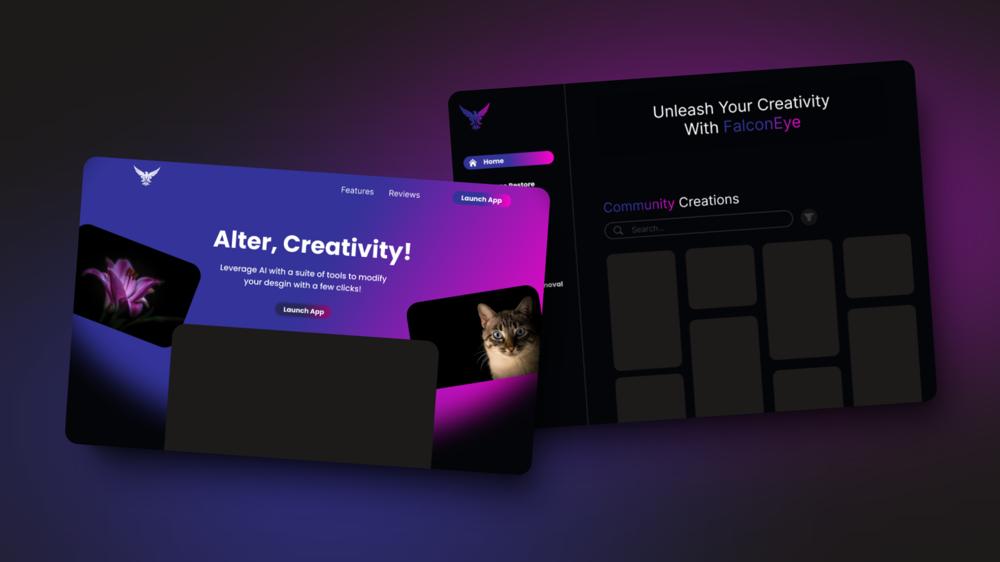
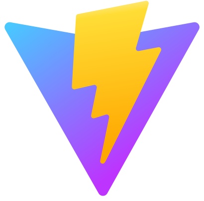
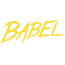
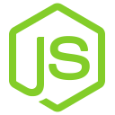
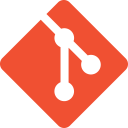

<div align="center" style="display:flex; justify-content: center; ">
  
</div>
<br>

## 📂 Table of Contents
- [📂 Table of Contents](#-table-of-contents)
- [📋 Project Description](#-project-description)
- [✨ Features](#-features)
- [⛏️ Built Using](#️-built-using)
  - [Frontend Skills](#frontend-skills)
  - [Backend Skills](#backend-skills)
  - [Other Skills](#other-skills)
  - [Design Skills](#design-skills)
- [🔍 Explore The Project](#-explore-the-project)
- [🎫 Dependencies](#-dependencies)
- [📥 Installation](#-installation)
- [📝 Usage](#-usage)
- [💳 License](#-license)
- [✍ Contributors](#-contributors)
- [🏅Acknowledgments](#acknowledgments)

## 📋 Project Description
FalconEye AI is an advanced web tool that allows users to perform a variety of image processing tasks with just a few clicks.

<div style="display:flex; justify-content: center;">
  
</div>

## ✨ Features
- AI-powered image restoration!
- Intuitive Object removal with AI!
- Smart background removal!
- Dynamic object recoloring, using computer vision (AI)!
- Generative fill with AI!
- Secure payment integration!
- Interactive, modern, and visual appealing  UX/UI!
- Spacial brand!
- Users can view others creations!
- Users can sign up and log in!
- Integrating the frontend with the backend!
- Around 10 pages!
- And more!

## ⛏️ Built Using


### Frontend Skills

<a href="https://reactjs.org/" target="_blank" rel="noreferrer"> </a>
<a href="https://www.javascript.com/" target="_blank" rel="noreferrer"></a>
<a href="https://vitejs.dev/" target="_blank" rel="noreferrer"></a>
<a href="https://babeljs.io/" target="_blank" rel="noreferrer"></a>
<a href="https://tailwindcss.com/" target="_blank" rel="noreferrer"></a>
<a href="https://developer.mozilla.org/en-US/docs/Glossary/HTML5" target="_blank" rel="noreferrer"></a>
<a href="https://www.w3.org/TR/CSS/#css" target="_blank" rel="noreferrer"></a>

### Backend Skills

<a href="https://nodejs.org/en/" target="_blank" rel="noreferrer"></a>
<a href="https://expressjs.com/" target="_blank" rel="noreferrer"></a>
<a href="https://www.mongodb.com/" target="_blank" rel="noreferrer"> </a>

### Other Skills

<a href="https://git-scm.com/" target="_blank" rel="noreferrer"></a>
<a href="https://github.com/" target="_blank" rel="noreferrer"></a>

### Design Skills

<a href="https://www.figma.com/" target="_blank" rel="noreferrer"></a>
<a href="https://www.canva.com/" target="_blank" rel="noreferrer"></a>
<br>


## 🔍 Explore The Project
- [Coming Soon]()

## 🎫 Dependencies

- You can check the package.json file for the project dependencies

## 📥 Installation

1. Clone the project or download the zip version of the project then unzip it
2. You need to install [node.js=18.20.2](https://nodejs.org/en/blog/release/v18.20.2), to ensure compatibility as the project built with it
3. Add node.js to environment variables (PATH)
4. Use the package manager npm to install all the dependencies specified within the package.json file using the command line within the root directory of the project:
   ```shell
   npm install
   ```

## 📝 Usage

To explore FalconEye AI, follow the following steps:

1. Follow [📥 Installation](#-installation) process
2. Run the development environment or build the production environment
   - To run the development environment, use the following command using the command line within the root directory of the project:
     ```shell
     npm run dev
     ```
   - To build the production environment, use the following command using the command line within the root directory of the project:
     ```shell
     npm run build
     ```

## 💳 License
- [MIT](https://choosealicense.com/licenses/mit/)

## ✍ Contributors
- Mohammed Dhabaab
  - [Website](https://mohammeddhabaab.com/)
  - [LinkedIn](https://www.linkedin.com/in/mohammed-dhabaab/)
  - [GitHub](https://github.com/mohammed-dhabaab)
- Abdulaziz Alhazmi
  - [LinkedIn](https://www.linkedin.com/in/abdullaziz-alhazmi-919599271/)
  - [GitHub](https://github.com/comsaziz)
- Najwa Almutairi
  - [GitHub](https://github.com/NajwaAlmutairi)
- Rana Almalki
  - [LinkedIn](https://www.linkedin.com/in/rana-almalki-computer-science)
  - [GitHub](https://github.com/ranaalmalki)


## 🏅Acknowledgments
- [Tuwaiq Academy](https://tuwaiq.edu.sa/)
